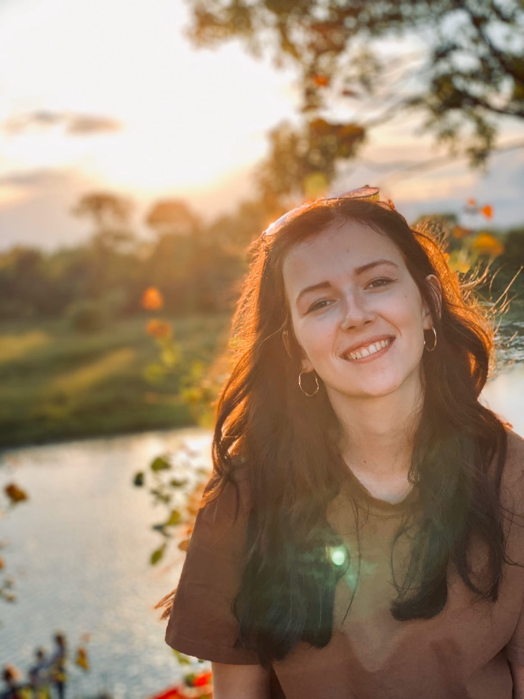

**Hello, world!**

Меня зовут Таня. Я учусь на Нетологии и хочу стать **fullstack-разработчиком на Python**.

Сейчас я работаю BIM-мастером в архитектурном бюро. 
 
 Я очень творческий человек и создаю под личным брендом:
 1. Сумки из бисера.
 2. Роспись на одежде.
 3. Украшения.
